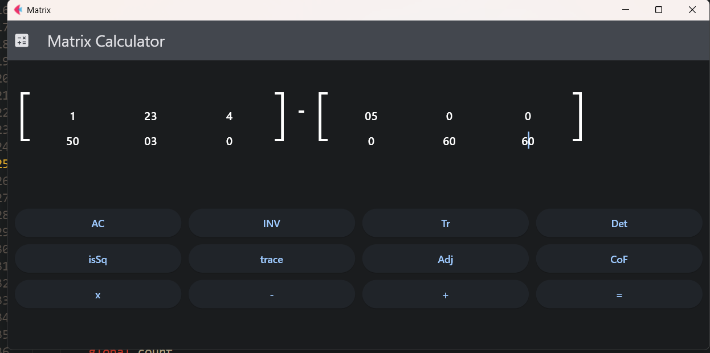
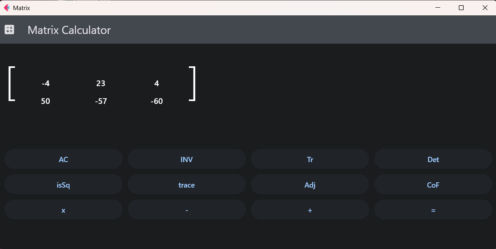

# MatrixCalculator
<p align="center">
  
  
</p>
Calculator that can perform simple matrix operations such as addition,substraction,multiplication,determinant,inverse etc with the help of a simple GUI made in flet framework.

# Installation
```
git clone https://github.com/muniss950/Matrix-Calculator
sudo pip install flet
flet run main.py
```
